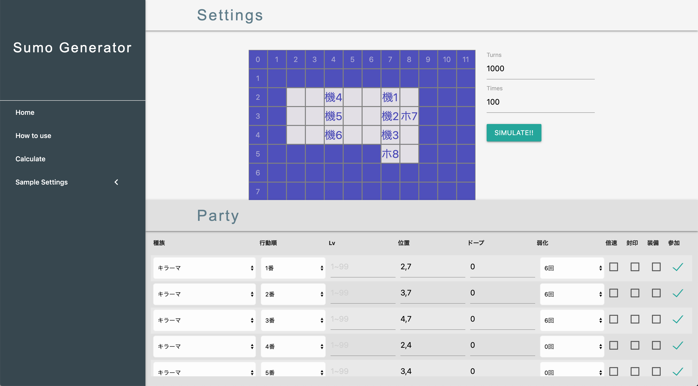

# README

## Sumo Generator

version
  - Rails: 6.0.0
  - Ruby: 2.6.3
  - vue: 2.6.10

## 概要

本アプリケーションでは「トルネコの大冒険3(2002年発売)」にて行われるスモールグールコンボ（通称スモコン）をブラウザ上でシミュレートすることができます。

## スモールグールコンボについて

ここでは本アプリケーションでのシミュレート対象であるスモールグールコンボについて、その原理を簡単に紹介します。  
本作ではドラゴンクエストに登場するモンスターを仲間ユニットとして連れ歩くことができます。スモールグールコンボはこれらの仲間ユニットの特性を利用して大量の経験値を獲得するテクニックです。
  
fig.1

まず図1のようにユニットを配置します。ユニットは淡色のマスにのみ存在することができ、濃色のマスは壁となっておりユニットは存在できません。
配置した各ユニットの特性は以下の通りです。
- 種（スモールグール、敵ユニット）
  - 攻撃を受けると分裂する
- 機（キラーマシーン、仲間ユニット）
  - 攻撃力を意図的に下げることができる
  - 下側に配置された3体のみ攻撃力を下げている
- ホ（ホイミスライム、仲間ユニット）
  - 周囲のユニットを敵味方関係なく回復する

また各ユニットは毎ターンそれぞれ1度だけ行動し、隣接した敵にのみ攻撃することができます。  
ここで丸で囲った「機」、「種」に着目します。この2体は互いに攻撃しあいますが、機は攻撃力が下がっているため種を攻撃しても1ターンでは倒すことができません。また種は機からの攻撃を受けると淡色のマスに分裂します。この両者の回復を下方の「ホ」が担うことによってこの状況が永続化します。

fig.2

さて、しばらくターンが経過すると図2のような状態になります。ここで「す」は分裂によって生まれたスモールグールを表します。上側3体の機は1ターンで「す」を倒すことができるので、経験値を獲得し続けることができます。

## アプリケーション作成意図
実機プレイでスモールグールコンボを行うには、約20時間程度の準備時間が必要となり、さらに1回のコンボに約40分ほどの時間が必要になります。また本作では「セーブポイントからリスタートする」ということができないため、万が一コンボに失敗する（仲間ユニットの死亡等）とこれまでにかけた時間が水の泡になってしまいます。そこで、ブラウザ上で事前にシミュレーションを行うことによってリスクを軽減したいと考えました。

## 実装

本アプリケーションはフロントエンドにvue.jsを採用したSPAです。現状では計算用apiサーバとしてのみRailsを利用しています。また計算のためのプログラムは"app/lib/sumo_combo/"以下にモジュール化して設置しています。

### vueコンポーネントによる入力フォームの作成

各unitの位置情報が入力されると、対応するマスにそのユニットが表示されます。またここでは説明を省いた詳細なパラメータを設定することができます。  
Simulateボタン押下でユーザーが指定した任意のセッティングで上述したコンボのシミュレートを行い、結果を表示します。なお、送信する情報が多いためpostメソッドで送信しています。これにあたりRailsの生成するcsrfトークンをmetaタグから取得しheaderに追加しています。

### 計算モジュールの作成
上述したように計算のためのプログラムはRubyで記述しています。  
Rails環境下ではすでに多くの機能がobject-orientedに設計されているため、自身でClassやModuleの実装を行う機会があまりありませんでした。そこで計算モジュールの実装では「object-orientedなコーディングの習得」、「RubyにおけるClass, Moduleの概念と基本的な取り扱いの理解」をテーマとして取り組みました。

## 今後の実装の予定

- 汎用的なサンプルのセッティングをいくつか用意し、フォーム入力の負担を減らす。
- SPAでのユーザ認証を可能にする。
- 登録済みのユーザに関しては自身のセッティングを保存し、任意に呼び出せるようにする。

